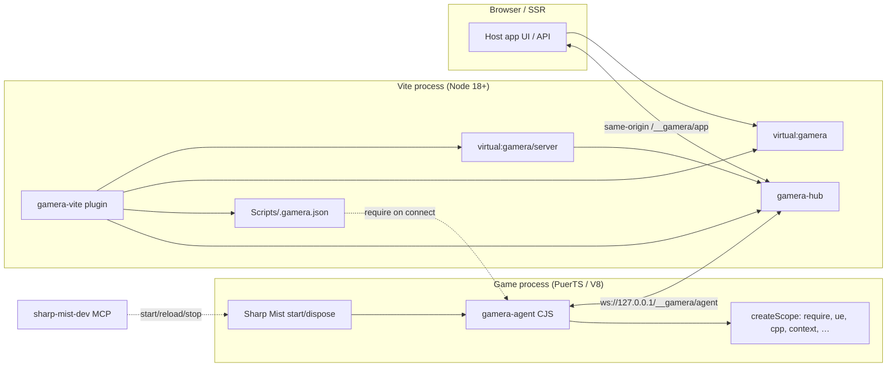
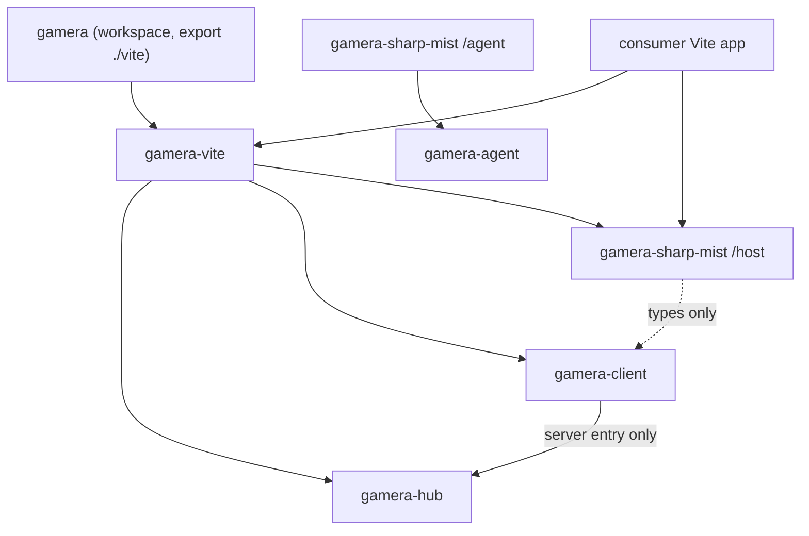
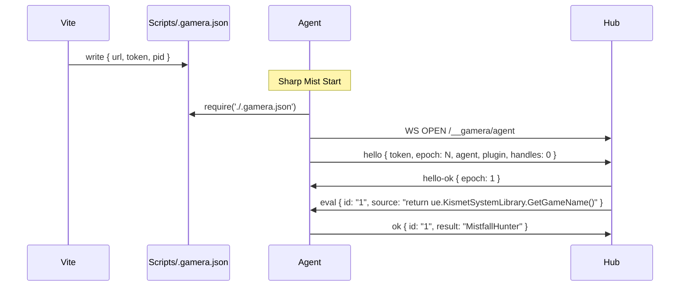

# Gamera Architecture

| Field | Value |
|---|---|
| **Document** | Gamera full architecture |
| **Author** | TBD |
| **Date** | 2026-08-14 |
| **Status** | Draft (revised after review 20152a66) |
| **Repo** | `C:\src\Gamera` (`git@github.com:mattneel/gamera.git`) |
| **Supersedes** | `C:\src\MistfallAuctionSniper\docs\PUERTS-BRIDGE.md` (names stale; product is Gamera) |

---

## Overview

Retail Mistfall Hunter scripts run in Sharp Mist / PuerTS inside the game process. That runtime is V8 + Puerts, not Node: `require('http')` / `net` / `fs` fail, `FHttpServerModule` / `IHttpRouter` / `FWebSocketServer` / Remote Control are absent, and `ffi_bindings` is missing. What exists is a **client** WebSocket (`globalThis.WebSocket` over `WebSocketPP`, the same path `ChatWSManager` uses), an HTTP **client** (`cpp.FHttpUtils`), Oasis file I/O (`UE.OasisFileLibrary`), and the Sharp Mist `start` / `dispose` lifecycle. Gamera does not call `LaunchURL` or open the system browser.

Gamera is a Vite-hosted outbound bridge. The game cannot listen, so the injected agent dials `ws://127.0.0.1`. The hub is a Node library with no Vite types. A thin Vite plugin attaches that hub to `configureServer` / `configurePreviewServer`, writes a discovery file, and exposes `virtual:gamera` (browser) and `virtual:gamera/server` (SSR / middleware). Each title is a game plugin that supplies bound eval scope, discovery path, travel/epoch, and an optional kill switch. Application code looks like a normal local API; eval is the transport, not the interface.

```ts
import { game } from 'virtual:gamera'

const name = await game.eval('return ue.KismetSystemLibrary.GetGameName()')
```

---

## Background & Motivation

### Current state

`C:\src\MistfallAuctionSniper` already ships a complete in-game product: XState machines, SharpMist GUI, Oasis dual-slot persistence, and a serialized request scheduler, all stuffed into a 512 KiB CommonJS bundle (`packages/sharp-mist-app` + `src/`). That is the wrong place for UI, charts, and strategy. The sniper remains a future *host app* of Gamera, not the framework.

Live probes in `C:\src\MistfallAuctionSniper\probes\` already established the channel. The table is **as of the 2026-08-13 live run** that produced those scripts and the design’s stated results. Saved-directory dump JSON (`SharpMist_*Probe.json`) is not in the repo and was not re-read for this revision; treat “absent / present” as that run’s observation, not a freshly re-executed dump.

| Probe | Result (2026-08-13 live run) |
|---|---|
| `node-http-probe.js` | Node builtins (`http`, `net`, `fs`, `node:http`) fail with `can not find … in Scripts`. No listen. |
| `ue-remote-control-probe.js` | `HttpServerModule`, `FHttpServerModule`, `IHttpRouter`, `WebControl.StartServer` absent. Remote Control is an Editor plugin. |
| `ue-websocket-probe.js` | `WebSocketNetworking` / `FWebSocketServer` absent. `WebSocket` + `WebSocketPP` present (client only). |
| `ue-channel-probe.js` | `cpp.FHttpUtils` present (client). `ffi_bindings` missing. `UE.OasisFileLibrary` + `LaunchURL` present. |

The Sharp Mist sidecar (`sharp-mist-dev`, wired in `C:\src\Gamera\.mcp.json`) can start / reload / stop scripts and tail logs. It must **not** host the product UI.

### Pain points this removes

- Every new tool currently re-implements a 512 KiB in-game app.
- UI and tests cannot use React, Vite HMR, IndexedDB, or Node files.
- A curated RPC allowlist would re-export every `require('module/…')` call anyway.
- Hardcoding `ws://127.0.0.1:5173` breaks the moment Vite picks another port.

### Why eval is the transport

Sharp Mist Start is already arbitrary in-process code. The other end is a process the developer launched on loopback. An allowlist does not shrink the trust boundary; it only forces a stub per game method. Host-sent source compiled with `new Function` and named scope arguments is the whole surface.

---

## Goals & Non-Goals

### Goals

- Outbound WebSocket from the game to `127.0.0.1`; full-duplex once open.
- Eval with a bound named-argument scope. No `with`. No RPC allowlist.
- Core library first. Vite plugin is an adapter. Hub has zero Vite types.
- Games are plugins. Core does not know Mistfall, Steam, TradeCtrl, or CfgMgr.
- Application code imports `virtual:gamera` and later `game.trade.my()`. Handles, epoch, and reconnect stay inside the hub.
- Vite is the only host process. React / Vue / Svelte / Solid / vanilla / SSR / Hono all sit on `configureServer`.
- Discovery file `{ url, token, pid }` written next to the inject. No hardcoded 5173.
- JSON-safe results as JSON; live objects as `{ $h: id }`; handles die on epoch change.
- Crash-safe mutations checkpoint Oasis *inside the same eval* before the write.
- First live slice: hello + `GetGameName()` + one AttributeSet *compute* + one CfgMgr table dump.

### Non-goals

- In-game HTTP / `HttpServerModule` / Unreal Remote Control.
- Hosting the product UI from `sharp-mist-dev`.
- Transparent deep proxies over the wire.
- Shipping a generic eval agent to the Script Store.
- Reversing Steam login or building an unofficial protocol client.
- Replacing Oasis with host-only persistence for live trades.
- Putting Mistfall typed facades (`trade`, inventory, CfgMgr) in Gamera core.
- Opening the system browser (`LaunchURL` or otherwise). Discovery + the operator opening Vite is enough.
- Seeding game-net pacing (gaps, frequency-limit codes, `sendRequest` wraps) in hub, client, or agent.
- Rewriting the auction sniper in this project.
- Building the Mistfall build calculator inside `packages/*`.

---

## Key Decisions

| Decision | Choice | Rationale |
|---|---|---|
| Direction | Game dials out to Vite | Retail PuerTS cannot listen. `ChatWSManager` already proves client WS works. |
| Transport vs API | Eval is transport; `game.*` is the API | Avoids a stub per game method. Apps never see `new Function`. |
| Eval binding | `new Function(...keys, source)(...values)` | Named arguments, `"use strict"`. `with (scope)` is sloppy and leaks identifiers. |
| Trust model | Localhost + token + one agent socket | Sharp Mist Start is already RCE in-process. Do not widen the bind or multiplex agents. |
| Package split | Four+ packages, no shared runtime graph | PuerTS cannot import `ws` / Vite / Node. Hub cannot import Vite types. |
| Games | Plugins, not core modules | A second PuerTS title is another `createScope()` + drop path. |
| Host | Vite `configureServer` / `configurePreviewServer` | Already an HTTP server, WS upgrade target, and framework hole. No second Node server. |
| Discovery | `Scripts/.gamera.json` `{ url, token, pid }` | PuerTS can `require` JSON from Scripts. Vite's port is not stable. |
| Objects over the wire | Handles + epoch, not deep proxy | Travel invalidates UObjects. Property-level RPC is slow and racy. |
| Persistence | Oasis in-eval is source of truth | A mutation that must survive a crash cannot wait for a WS round-trip. |
| Game-net pacing | Not a Gamera-core concern | Hub, client, and agent seed no gaps and wrap no game-net API. A game plugin that wants a gate owns the helper and the numbers. |
| First product | Build calculator is a consumer | Mines live `CfgMgr` / `StkAttributes`. Not a Gamera package. |
| Sidecar | Reload/log/MCP only | `.mcp.json` already points at `sharp-mist-dev`. It does not serve UI. |
| `$h` vs JSON | See §9 predicate | `Map`/`Set` walked; UObject / function-own-keys → handle; own-enumerable DTOs (incl. cfg-row prototypes) recurse. |
| Epoch store | `globalThis.__gameraEpoch` | Survives CJS re-eval after `quiesceAll`. Increment on `start()` and explicit `bump()`, not on `onReady`. |
| Abort surface | `EvalHandle.id` + `abort()` | `await game.eval()` still works. Abort-after-settle is `err` `Aborted`, never a silent skipped `ok`. |
| Discovery re-read | `puerts.forceReload` + Oasis `ReadFile` | PuerTS has no `require.cache` / `require.resolve`. Sidecar `reload_script` is the last fallback. |
| App-socket auth | Loopback + same-origin only | `/__gamera/app` does not use the agent token. Token is agent-hello only. |
| Browser open | Never `LaunchURL` | Discovery + the operator opening Vite is enough. Not default-off; not an option. |

---

## Proposed Design

### 1. Runtime topology

```text
  agent (generic eval loop + game-plugin scope)
         \
          \  WS /__gamera/agent          virtual:gamera          (browser, many)
           \                              |
            +---------- hub --------------+
           /                              |
  Vite plugin (attach + discovery)       virtual:gamera/server  (SSR / Hono, in-process)

  sharp-mist-dev  --start/reload/stop-->  GameraAgent.cjs
  (not on the data path)
```



One Vite process. One agent socket. Many browser / SSR clients.

### 2. Package graph

Runtimes cannot share a module graph. The seed already has a workspace root (`C:\src\Gamera\package.json`, `workspaces: ["packages/*"]` today — **no** `exports["./vite"]` yet) and a Vite-plugin stub (`packages/vite-plugin`, npm name `gamera-vite`). PR 1 must add the root export and expand workspaces so `examples/hello` is a real package.

```text
C:\src\Gamera\
  package.json                 name: gamera  (exports ./vite; workspaces packages/* + examples/*)
  packages/
    hub/                       gamera-hub          Node, no Vite types
    client/                    gamera-client       browser WS + server in-process
    vite-plugin/               gamera-vite         adapter (exists, stub)
    agent/                     gamera-agent        PuerTS CJS, no Node/Vite
    sharp-mist/                gamera-sharp-mist   first game plugin
  examples/
    hello/                     private workspace package, CI dogfood (not a product)
```



**Dependency rules (enforced by package.json + esbuild externals):**

| Package | May import | Must not import |
|---|---|---|
| `gamera-hub` | `ws`, Node `http`/`crypto` | `vite`, `gamera-agent`, `gamera-vite` |
| `gamera-client/browser` | nothing Node-specific | `gamera-hub`, `ws`, `vite`, `gamera-agent` |
| `gamera-client/server` | `gamera-hub` | `vite`, `gamera-agent` |
| `gamera-vite` | `gamera-hub`, `gamera-client` (for virtual codegen), `vite` (peer) | `gamera-agent` |
| `gamera-agent` | nothing from the monorepo except types erased at build | `ws`, `vite`, Node builtins, `gamera-hub` |
| `gamera-sharp-mist/host` | `gamera-vite` types, `node:fs` | `gamera-agent` runtime |
| `gamera-sharp-mist/agent` | `gamera-agent` | Node, Vite |

Root `package.json` grows an export so the README import stays valid:

```json
{
  "name": "gamera",
  "exports": {
    "./vite": "./packages/vite-plugin/src/index.ts"
  }
}
```

```ts
// vite.config.ts
import { defineConfig } from 'vite'
import { gamera } from 'gamera/vite'
import sharpMist from 'gamera-sharp-mist'

export default defineConfig({
  server: { host: '127.0.0.1' },
  plugins: [
    gamera({
      game: sharpMist({
        scriptsDir: 'C:/Users/requi/Documents/Sharp Mist/Scripts',
      }),
    }),
  ],
})
```

The injected bundle is **not** an npm import for Vite apps. `gamera-sharp-mist` ships a build script that emits `Scripts/GameraAgent.cjs` (or a caller-chosen path) by esbuild-bundling `gamera-agent` + the Sharp Mist `createScope`. Same pattern as `C:\src\MistfallAuctionSniper\packages\sharp-mist-app\build.mjs`: `format: 'cjs'`, `platform: 'neutral'`, `target: 'es2020'`, externals `./SharpMist/*`, `ue`, `puerts`, `cpp`, `module/*`, `config`, `config/*`, `net/*`, `protocols/*`, `ui/*`, `utils/*`, `core/*`. Fail the production build above 512 KiB (CI job on the agent package, assigned in PR 4). Target for the generic agent + Sharp Mist adapter: **< 64 KiB**.

### 3. Hub (`packages/hub`)

The hub is a Node library. It attaches to an already-listening `http.Server`, owns the agent session, the eval in-flight map, epoch, and fan-out to app sockets. It does not create a second HTTP server and does not import Vite.

```ts
// packages/hub/src/index.ts
import type { Server as HttpServer, IncomingMessage } from 'node:http'
import type { Duplex } from 'node:stream'

export const PROTOCOL_VERSION = 1 as const
export const DEFAULT_PREFIX = '/__gamera'

export interface HubAttachOptions {
  server: HttpServer
  /** URL prefix. Default `/__gamera`. */
  path?: string
  /** Handshake secret written into the discovery file. */
  token: string
  /** Refuse non-loopback remotes. Default true. */
  loopbackOnly?: boolean
  /** In-flight eval timeout. Default 30_000. */
  evalTimeoutMs?: number
  log?: (level: 'debug' | 'info' | 'warn' | 'error', msg: string, extra?: unknown) => void
}

export interface HelloInfo {
  epoch: number
  agent: string
  plugin?: string
  game?: string
  protocol: number
  /** Agent-side live handle count at hello / epoch. */
  handles?: number
}

export interface EvalOptions {
  timeoutMs?: number
  lane?: 'read' | 'mutation'
  /** If set, hub rejects when session epoch !== this value. */
  epoch?: number
}

/** Thenable so `await game.eval(...)` still works. `id` is the **app** id. */
export interface EvalHandle<T> extends Promise<T> {
  readonly id: string
  abort(): void
}

export type HubEventName =
  | 'hello'
  | 'disconnect'
  | 'epoch'
  | 'event'
  | 'log'

export interface GameraHub {
  readonly connected: boolean
  readonly epoch: number
  readonly hello: HelloInfo | undefined
  eval<T = unknown>(source: string, opts?: EvalOptions): EvalHandle<T>
  /** Abort by **app** id (`handle.id`). Hub rewrites to the agent id on the wire. */
  abort(id: string): void
  on(event: HubEventName, listener: (payload: unknown) => void): () => void
  waitForAgent(timeoutMs?: number): Promise<HelloInfo>
  /** Same-process client used by virtual:gamera/server. */
  createServerClient(): GameClient
  close(): void
}

export function attachHub(options: HubAttachOptions): GameraHub
```

**Attach mechanics**

1. Construct a `ws.WebSocketServer({ noServer: true })`.
2. Listen on `server.on('upgrade')`. Parse the URL. If the pathname is not under `path`, **return without touching the socket** so Vite HMR still upgrades `/`.
3. If `loopbackOnly` and `req.socket.remoteAddress` is not `127.0.0.1` / `::1` / `::ffff:127.0.0.1`, `socket.destroy()`.
4. Paths:
   - `${path}/agent` — single agent. If a socket is already OPEN, close the new one with code `4000` (`agent already connected`).
   - `${path}/app` — many browser clients. Fan-out events; forward `eval` / `abort` to the same session.
   - anything else under `path` — close `4001`.
5. Do not authenticate app sockets beyond loopback + same-origin. The agent token is not a browser secret. This is a decision, not a gap: `/__gamera/app` is intentionally unauthenticated on loopback.

**Eval queue**

- Each `eval` gets a monotonic **hub** string id (`1`, `2`, …) on the agent wire, and a separate monotonic **app** id (`a1`, `a2`, …) returned as `EvalHandle.id`.
- Frames sit in `pending` until an agent is connected and hello-ok has been sent; then they flush in insert order.
- Multiple evals may be in-flight (PuerTS is single-threaded but `await` yields). Core does not serialize game-net calls. A title that needs a gate implements it in its game plugin.
- Disconnect or epoch bump rejects every in-flight / pending eval with `GameDisconnected` / `StaleEpoch`.
- Default timeout 30 s; the hub sends `{ kind: "abort", id }` (agent id) then waits briefly for `err` `Aborted`.
- Abort is best-effort because JS cannot be preempted, but it is **never silent**: if the eval later settles, the agent sends `err` `{ code: "Aborted" }` instead of `ok`. The app Promise rejects with `Aborted`. An abort after `ok`/`err` has already been sent is a no-op.

**Hub-side epoch**

The hub's `epoch` is a copy of the agent's last hello/event epoch. It does not invent epochs. It invalidates remembered `$h` ids only when the hello epoch changes.

Travel’s happy path is **dispose → Start → hello with a new epoch**, not an in-process bump (see §6). A re-evaluated CJS module would reset an in-memory `let epoch = 1` back to 1 and fail the travel test; the agent therefore persists the counter on `globalThis.__gameraEpoch` so every `start()` is N+1.

### 4. Client (`packages/client`)

Two implementations, one TypeScript surface. Core never grows `trade` / `cfg` / inventory.

```ts
// packages/client/src/types.ts
export interface GameClient {
  readonly connected: boolean
  readonly epoch: number
  eval<T = unknown>(source: string, opts?: EvalOptions): EvalHandle<T>
  /** App id only (`handle.id`), never the rewritten agent id. */
  abort(id: string): void
  on(name: string, listener: (payload: unknown) => void): () => void
  ready(timeoutMs?: number): Promise<HelloInfo>
}

export class GameDisconnected extends Error {
  name = 'GameDisconnected'
}
export class StaleEpoch extends Error {
  name = 'StaleEpoch'
  constructor(public expected: number, public actual: number) {
    super(`stale epoch: expected ${expected}, got ${actual}`)
  }
}
export class StaleHandle extends Error {
  name = 'StaleHandle'
}
export class MutationsDisabled extends Error {
  name = 'MutationsDisabled'
}
```

- `packages/client/src/browser.ts` — `new WebSocket` to same-origin `${prefix}/app`. Reconnect with backoff. Surface the same errors.
- `packages/client/src/server.ts` — holds the `GameraHub` singleton created by `attachHub`. No socket.

Game plugins add typed facades by wrapping, never by editing this interface. The Vite plugin can only **import** a module id into `virtual:gamera`; a live function from `vite.config.ts` cannot be serialized into the browser bundle. Therefore `GameraGamePlugin` has `facadesModule` only (no `createFacades` callback).

```ts
// gamera-sharp-mist/facades.ts  (optional, not in first slice)
import type { GameClient } from 'gamera-client'

export interface SharpMistGame extends GameClient {
  trade: { my(): EvalHandle<unknown> }
}

export function createFacades(client: GameClient): SharpMistGame {
  return Object.assign(client, {
    trade: {
      my: () => client.eval(`
        const { TradeCtrl } = require('module/Trade/TradeCtrl');
        return TradeCtrl.get(context.get()).requestMyTradeStall();
      `, { lane: 'read' }),
    },
  })
}

declare module 'virtual:gamera' {
  export const game: SharpMistGame
}
declare module 'virtual:gamera/server' {
  export const game: SharpMistGame
}
```

`TradeCtrl` is a named export (`exports.TradeCtrl`, no `default`). The live method is `requestMyTradeStall()` (`GameSource/module/Trade/TradeCtrl.js`). `trade.my()` is **not** in Gamera core and is **not** shipped in the first slice. The snippet exists so it is not pasted wrong. The build calculator adds CfgMgr helpers in the calculator app or in `gamera-sharp-mist`, not in `gamera-client`.

### 5. Vite plugin (`packages/vite-plugin`)

The seed at `packages/vite-plugin/src/index.ts` already declares the public names. Extend them; do not rename.

```ts
import type { Plugin, ViteDevServer } from 'vite'

export interface GameraDiscovery {
  url: string
  token: string
  pid: number
  appUrl?: string
}

export interface GameraGamePlugin {
  /** Absolute path written by the host and re-read by the agent. */
  discoveryPath: string
  /** Optional path of the inject bundle (docs / copy / build output). */
  agentPath?: string
  writeDiscovery?(info: GameraDiscovery): void
  /**
   * Browser-importable module id that exports
   * `createFacades(client: GameClient): GameClient`.
   * Used only for virtual-module codegen. There is no live `createFacades` callback.
   */
  facadesModule?: string
}

export interface GameraPluginOptions {
  game: GameraGamePlugin
  path?: string          // default '/__gamera'
  host?: string          // unused for bind; Vite `server.host` wins. Kept for docs.
  token?: string         // default crypto.randomBytes(32).hex → 64 hex chars
}

export function gamera(options: GameraPluginOptions): Plugin
```

`attach` (currently a stub) does. The bind check inspects **`http.address()` after `listening`**, not `options.host` (Vite’s bind is `server.host` in `vite.config.ts` and is independent). Never invent port 5173. Guard with a `WeakMap` so a double `configureServer` is a no-op.

```ts
const attached = new WeakMap<object, GameraHub>()

function isLoopbackAddress(host: string): boolean {
  return host === '127.0.0.1' || host === '::1' || host === '::ffff:127.0.0.1'
}

function attach(server: ViteDevServer, prefix: string, options: GameraPluginOptions): void {
  const http = server.httpServer
  if (!http) return
  if (attached.has(http)) return
  const token = options.token ?? randomToken()
  const start = () => {
    const addr = http.address()
    if (!addr || typeof addr !== 'object') {
      throw new Error('gamera: http.address() is not bound; refuse to invent a port')
    }
    if (!isLoopbackAddress(addr.address)) {
      throw new Error(`gamera: refuse non-loopback listen ${addr.address} (set server.host = "127.0.0.1")`)
    }
    const port = addr.port
    const hub = attachHub({ server: http, path: prefix, token })
    attached.set(http, hub)
    setHub(hub) // gamera-vite/runtime process singleton
    const info: GameraDiscovery = {
      url: `ws://127.0.0.1:${port}${prefix}/agent`,
      token,
      pid: process.pid,
      appUrl: `http://127.0.0.1:${port}/`,
    }
    const write = options.game.writeDiscovery ?? defaultWrite(options.game.discoveryPath)
    write(info)
    server.config.logger.info(`[gamera] agent ${info.url}`)
  }
  if (http.listening) start()
  else http.once('listening', start)
}
```

Hub `loopbackOnly` still destroys non-loopback *peers* as defense in depth. Attach itself refuses `0.0.0.0` / `::` / `host: true` so the process is not listening on the LAN.

`gamera-vite` package exports must include `./runtime` → `src/runtime.ts`:

```ts
// packages/vite-plugin/src/runtime.ts
import type { GameraHub } from 'gamera-hub'
let hub: GameraHub | undefined
export function setHub(next: GameraHub): void { hub = next }
export function getHub(): GameraHub {
  if (!hub) throw new Error('gamera hub not attached')
  return hub
}
```

Virtual modules (replace the `/@gamera/client/browser?prefix=` hop in the stub with a single generated module). `facadesModule` is inlined as an import specifier; there is no other facade hook.

```ts
resolveId(id) {
  if (id === 'virtual:gamera') return '\0virtual:gamera'
  if (id === 'virtual:gamera/server') return '\0virtual:gamera/server'
}
load(id) {
  const facades = options.game.facadesModule
  const wrap = facades
    ? `import { createFacades } from ${JSON.stringify(facades)}\nconst wrap = createFacades\n`
    : `const wrap = (c) => c\n`
  if (id === '\0virtual:gamera') {
    return `
      import { createBrowserClient } from 'gamera-client/browser'
      ${wrap}
      export const game = wrap(createBrowserClient(${JSON.stringify({ path: prefix + '/app' })}))
    `
  }
  if (id === '\0virtual:gamera/server') {
    return `
      import { getHub } from 'gamera-vite/runtime'
      ${wrap}
      export const game = wrap(getHub().createServerClient())
    `
  }
}
```

`configurePreviewServer` uses the same `attach`. Preview is how a built SPA still talks to a running game.

**Vite `server.host`:** developers must set `server: { host: '127.0.0.1' }`. After listen, `addr.address` must be loopback or attach throws. `options.host` is not the bind.

### 6. Agent (`packages/agent`)

Managed CommonJS. Exports `start()` / `dispose()`. No Node, no Vite, no `ws` package. Uses `globalThis.WebSocket` — the PuerTS polyfill in `GameSource/puerts/websocketpp.js` that wraps `WebSocketPP` and pumps events on a 1 ms `setInterval`. This is the same constructor `ChatWSManager.initWS` uses.

```ts
// packages/agent/src/index.ts  (erased to CJS)
export interface HandleTable {
  retain(value: unknown): number
  get(id: number): unknown
  drop(id: number): void
  has(id: number): boolean
  clear(): void
}

export interface AgentApi {
  send(name: string, payload?: unknown): void
  track(disposer: () => void): void
  handles: HandleTable
  readonly epoch: number
  log: { debug: Log; info: Log; warn: Log; error: Log; success?: Log }
  mutationsEnabled: boolean
}

export interface AgentGameAdapter {
  createScope(agent: AgentApi): Record<string, unknown>
  /** Relative require id, e.g. './.gamera.json'. */
  discoveryId: string
  /** Absolute path the host wrote (baked at inject build from `scriptsDir`). */
  discoveryAbsPath: string
  /**
   * Subscribe to *in-process* context loss only. Return an unsubscribe.
   * Do **not** wire this to `context.onReady` (immediate=true would bump on
   * every better GameInstance publish). Travel’s happy path is dispose→Start.
   */
  onEpoch?(bump: (reason: string) => void): () => void
  createKillSwitch?(agent: AgentApi): { mount(): void; dispose(): void }
}

export function createAgent(adapter: AgentGameAdapter): { start(): void; dispose(): void }
```

**Eval implementation (named arguments, async body, no `with`):**

```js
async function runEval(source, scope) {
  const names = Object.keys(scope);
  for (const name of names) {
    if (!/^[A-Za-z_$][A-Za-z0-9_$]*$/.test(name)) {
      throw new Error(`scope key is not an IdentifierName: ${name}`);
    }
  }
  const fn = new Function(
    ...names,
    '"use strict";\nreturn (async () => {\n' + source + '\n})();',
  );
  return fn(...names.map((n) => scope[n]));
}
```

Wrapping in an async IIFE is a deliberate deviation from the one-liner in `PUERTS-BRIDGE.md`. Host source may use `await`. The agent still `await`s the return value before serializing.

**Lifecycle**

```text
start()
  epoch = ++globalThis.__gameraEpoch     // persists across CJS re-eval
  handles.clear()
  readDiscovery()                        // Oasis ReadFile / forceReload / require
  scope = adapter.createScope(api)
  context.onReady(refreshWorldBindings)  // refresh keys; do NOT bump epoch
  connect(url)                           // backoff 500ms → 8s
  on OPEN: send hello { token, epoch, agent, plugin, handles }
  wait hello-ok (or close)
  adapter.onEpoch(bump)                  // in-process loss only
  killSwitch.mount()
  on message: eval | abort | ping
  on reconnect (same start): keep epoch, handles.clear(), re-read discovery
dispose()
  run api.track disposers (LIFO)
  handles.clear()
  killSwitch.dispose()
  close socket, stop reconnect
```



**Reconnect and discovery cache**

`GameSource/puerts/modular.js` does **not** implement `require.cache` or `require.resolve`. Cache is a private `moduleCache`; the public bust is `puerts.forceReload(key)`, which sets `__forceReload` on the cached module. JSON `require` works (`.json` → `JSON.parse`). A Node-shaped `delete require.cache[require.resolve(id)]` no-ops, then `require(id)` returns the **old** `{ url, token }` after a Vite restart.

`forceReload` matches `moduleCache` keys, which are `fullPath` from `__tgjsSearchModule`, not `'./.gamera.json'`. The Sharp Mist adapter therefore bakes `discoveryAbsPath` (from `scriptsDir`) into the inject and tries slash-style variants. `puerts.forceReload()` with no argument would mark *every* module and is forbidden.

On every connect attempt:

```js
function readDiscovery(absPath, relativeId) {
  // 1. Non-require path: the host wrote this absolute file with node:fs.
  try {
    const files = require('ue').OasisFileLibrary;
    const raw = files && files.ReadFile && files.ReadFile(absPath);
    if (typeof raw === 'string' && raw.charAt(0) === '{') return JSON.parse(raw);
  } catch (_) {}

  // 2. Public PuerTS bust, then require. Key is searchModule fullPath.
  const p = globalThis.puerts;
  if (p && typeof p.forceReload === 'function' && absPath) {
    p.forceReload(absPath);
    p.forceReload(String(absPath).replace(/\\/g, '/'));
    p.forceReload(String(absPath).replace(/\//g, '\\'));
  }
  return require(relativeId);
}
```

If both paths still return a stale token, hello is rejected (4003) and the documented fallback is sidecar `reload_script` (re-evaluates the CJS entry). Fail closed on missing file, missing `url`/`token`, or hello rejected.

**Travel vs dispose**

`C:\Users\requi\Documents\Sharp Mist\Scripts\SharpMist\lifecycle.js` calls `quiesceAll` on `TSGameInstance.HandlePreLoadMap`, `HandleSeamlessTravelStart`, `HandleWorldTearDown`, and several match-end hooks. That **stops the managed script**. `context.invalidate` is only called from `quiesceAll`, which has already disposed the agent — there is no independent “soft travel” path.

Travel’s happy path:

```text
quiesceAll → dispose() → (autoload or operator) Start
  → ++globalThis.__gameraEpoch → hello { epoch: N+1, handles: 0 }
```

`globalThis.__gameraEpoch` uses the same survive-reload trick as `__sharpMistLifecycleState`. A fresh `let epoch = 1` in the re-evaluated module would hello epoch 1 again and the hub would not fail-fast old `$h` ids.

**Do not bump epoch on `context.onReady`.** `onReady(listener, immediate = true)` fires immediately when a world is already live and again whenever a better GameInstance is published. Subscribing it as `bump` would clear handles on a live camp session. `onReady` only **refreshes world-bound scope keys** (`context.get()`, pawn, controller) and emits `{ kind: "event", name: "context", payload: { ready, stage? } }`.

`adapter.onEpoch(bump)` is reserved for an explicit in-process context-loss signal the adapter may add later. It is not wired in v1 Sharp Mist.

Socket reconnect **without** a new `start()` (Vite restart, hub flip): keep the current epoch, `handles.clear()`, re-read discovery, hello with the same epoch and `handles: 0`. The new hub has no ids; clearing avoids a leak. Hosts must re-eval after `hello` anyway.

**Kill switch**

Optional. Sharp Mist adapter mounts one SharpMist/gui button (or a documented hotkey) that sets `agent.mutationsEnabled = false`, rejects new `lane: "mutation"` evals with `MutationsDisabled`, and emits `{ name: "kill" }`. Reads still run. This is the local abort when the host is wedged. Tiny HUD: connected / epoch / kill. No auction UI.

### 7. Game-plugin interface

A game plugin is two compile targets that share a name, not a module graph.

```ts
// ---------- host side (Node, imported from vite.config.ts) ----------
export interface SharpMistPluginOptions {
  scriptsDir: string
  /** Default `${scriptsDir}/.gamera.json`. */
  discoveryPath?: string
  /** Default `${scriptsDir}/GameraAgent.cjs`. */
  agentPath?: string
  /** Default true. Writes a 1×1 connected/kill window via SharpMist/gui. */
  killSwitch?: boolean
}

export default function sharpMist(options: SharpMistPluginOptions): GameraGamePlugin

// GameraGamePlugin is defined in gamera-vite (see §5).
```

```ts
// ---------- agent side (bundled into GameraAgent.cjs) ----------
import type { AgentGameAdapter, AgentApi } from 'gamera-agent'

export function createSharpMistAdapter(options?: {
  discoveryId?: string        // default './.gamera.json'
  discoveryAbsPath: string    // baked from scriptsDir at inject build
  killSwitch?: boolean
}): AgentGameAdapter

export function createScope(agent: AgentApi): Record<string, unknown>
```

**Bound scope (Sharp Mist).** Populate on `start()`, refresh world-bound entries on `context.onReady` (no epoch bump):

```js
{
  require,          // PuerTS require
  ue,               // require('ue')
  cpp,              // require('cpp')
  context,          // ./SharpMist/context
  hooks,            // ./SharpMist/hooks
  events,           // ./SharpMist/events
  logging,          // ./SharpMist/logging
  resilience,       // ./SharpMist/resilience (optional)
  oasis: ue.OasisFileLibrary,
  http: cpp.FHttpUtils,
  handles,          // agent.handles (also on agent)
  agent,            // { send, track, handles, epoch, log, mutationsEnabled }
}
```

`gui` / `drawing` are **not** in the default scope. The kill-switch adapter may `require('./SharpMist/gui')` privately. Host apps should not draw in-game windows.

Scope keys must be IdentifierNames. A second PuerTS title is another plugin with a different `createScope()` and a different `discoveryPath` (it may not even have a `Scripts/` folder).

**Host `writeDiscovery`**

```ts
import { writeFileSync, mkdirSync } from 'node:fs'
import { dirname } from 'node:path'

writeFileSync(discoveryPath, JSON.stringify(info, null, 2), 'utf8')
```

`.gitignore` already ignores `.gamera.json`. The file is local listen state, not source.

### 8. Wire protocol

One JSON object per WebSocket text message. No binary in v1. Every frame carries `"v": 1`. Unknown `kind` → ignore (forward compat). `v !== 1` → close `4002`.

#### Agent → Hub

**hello** (first message after OPEN; also after reconnect)

```json
{
  "v": 1,
  "kind": "hello",
  "token": "e3b0c44298fc1c149afbf4c8996fb92427ae41e4649b934ca495991b7852b855",
  "epoch": 1,
  "agent": "gamera-agent",
  "plugin": "gamera-sharp-mist",
  "game": "MistfallHunter",
  "handles": 0
}
```

`game` is best-effort (`ue.KismetSystemLibrary.GetGameName()` if already loadable). `handles` is the live handle-table size (0 after `start()` / reconnect clear). Hub compares `token` with constant-time equality. Mismatch → close `4003`.

**ok**

```json
{
  "v": 1,
  "id": "17",
  "kind": "ok",
  "epoch": 1,
  "result": "MistfallHunter"
}
```

**err**

```json
{
  "v": 1,
  "id": "17",
  "kind": "err",
  "epoch": 1,
  "error": {
    "name": "Error",
    "message": "…",
    "code": "EvalError",
    "stack": "…"
  }
}
```

`code` is one of: `EvalError`, `StaleEpoch`, `StaleHandle`, `Aborted`, `NotSerializable`, `Unauthorized`, `MutationsDisabled`, `Disconnected`. `stack` is omitted if empty. Hub copies `name`/`message`/`code` to the rejected Error.

**event**

```json
{
  "v": 1,
  "kind": "event",
  "epoch": 1,
  "name": "log",
  "payload": { "level": "info", "scope": "gamera", "message": "connected" }
}
```

Reserved event names and payloads:

| name | payload |
|---|---|
| `log` | `{ level, scope, message }` |
| `context` | `{ ready: boolean, stage?: 'Startup' \| 'Tavern' \| 'Camp' \| 'Dungeon' \| string }` — emitted from `context.onReady` after refreshing world bindings. `stage` is best-effort from `UE.EInstanceStage` / instance stage when readable. |
| `epoch` | `{ reason: string, handles: number }` — only when epoch actually increments (`start()` or explicit `bump()`). |
| `kill` | `{ mutationsEnabled: false }` |

Everything else is app-defined via `agent.send(name, payload)`.

**pong**

```json
{ "v": 1, "kind": "pong", "t": 1730000000000 }
```

#### Hub → Agent

**hello-ok**

```json
{ "v": 1, "kind": "hello-ok", "epoch": 1, "serverTime": 1730000000000 }
```

**eval**

```json
{
  "v": 1,
  "id": "17",
  "kind": "eval",
  "epoch": 1,
  "lane": "read",
  "source": "return ue.KismetSystemLibrary.GetGameName()"
}
```

`lane` is `"read"` (default) or `"mutation"`. It is a kill-switch hint (`mutationsEnabled` rejects `mutation`), not a scheduler and not a gap. Source hard-limit **256 KiB**. Oversize → `err` `EvalError` without compiling.

**abort**

```json
{ "v": 1, "id": "17", "kind": "abort" }
```

**ping** (every 15 s of silence)

```json
{ "v": 1, "kind": "ping", "t": 1730000000000 }
```

No pong within 10 s → hub closes. Agent does not need to ping; the polyfill has no browser-like WebSocket ping.

#### App ↔ Hub (`/__gamera/app`)

Same JSON shapes. The browser never sends `hello` with the agent token. Frames:

| Direction | kind | Notes |
|---|---|---|
| App → Hub | `eval`, `abort` | Proxied to the agent session |
| Hub → App | `ok`, `err`, `event`, `hello`, `epoch` | Fan-out. `hello` is a copy of the last agent hello so a late tab can catch up |

```mermaid
sequenceDiagram
  participant App as virtual:gamera
  participant Hub
  participant Agent
  App->>Hub: eval { id:"a1", source, lane:"read" }
  Hub->>Agent: eval { id:"17", epoch:4, source, lane:"read" }
  Agent->>Agent: new Function(...keys, async IIFE)
  Agent->>Agent: await result; serialize
  Agent->>Hub: ok { id:"17", epoch:4, result }
  Hub->>App: ok { id:"a1", result }
```

Hub rewrites ids so two browser tabs cannot collide. The agent only sees hub ids.

### 9. Serialization and handles

Walk the awaited return value. Classification is **not** “everything object-like is a handle” — that would turn a `Map` from `CfgMgr.getDynamicMap` and every cfg row (`Object.setPrototypeOf(v, AttributeDescCfg.prototype)`) into `$h`.

**Predicate (in this order):**

1. `null` / `boolean` / finite `number` / `string` → JSON as-is.
2. `undefined` at root → `null`; in an object → omit key.
3. `NaN` / `±Infinity` → `err` `NotSerializable`.
4. `typeof === 'function'` → `NotSerializable` (host sends another eval).
5. `Date` → ISO string.
6. protobuf `Long` / `{ low, high, unsigned }` (own keys, numeric `low`/`high`) → decimal **string**.
7. `value instanceof Map` → JSON array of `[serialize(k), serialize(v)]` pairs. `Set` → JSON array of serialized values. Do **not** retain Maps/Sets as handles.
8. `Array.isArray` → recurse elements.
9. **Handle** (`{ "$h": id }` after `handles.retain`) if any of:
   - `ue.IsValid(value)` is true. Wrap the call: Sharp Mist `context.js` always try/catches `UE.IsValid` because it throws on non-UObjects. Without that, an accidental `return map` of cfg rows fails the whole serialize instead of walking DTOs:

     ```js
     function isUObject(value) {
       try {
         return typeof ue !== 'undefined'
           && typeof ue.IsValid === 'function'
           && ue.IsValid(value);
       } catch (_) { return false; }
     }
     ```

   - any *own enumerable* property is a `function`
   - own-key set looks like a hook handle (`restore` own function already caught above)
10. Otherwise, if `typeof === 'object'`: recurse **own enumerable** keys only (cfg-row prototypes with `reset`/`add`/`apply` on the prototype, not as own keys, become DTOs). Depth cap **32**. Cycle → `NotSerializable`.
11. Anything else → `NotSerializable`.

No `$t` / `$m` / `$c` tagged types in v1. No transparent Proxy.

First-slice hosts must still convert Maps in eval source (see §13). The predicate makes an accidental `return map` JSON rows rather than a handle; it is not a license to dump an unconverted `ClassAttributesCfg` via `getDynamicMap` (that API is wrong for that table).

Next eval receives `handles` in scope:

```js
const ctrl = handles.get(1)
return ctrl.requestMyTradeStall()
```

`handles.get` on a missing or cross-epoch id throws an Error with `code: "StaleHandle"`.

Handles die when:

- epoch increments (`start()` / explicit `bump()` — travel is dispose→Start)
- socket reconnect clears the table without bumping epoch
- host eval calls `handles.drop(id)`
- `handles.clear()` / `dispose()`

The hub does **not** keep a mirror of handle values. It only remembers that `$h` ids from epoch N are invalid after hello epoch N+1, so it can fail fast before sending.

Result size: warn in hub logs above **8 MiB**. First slice dumps one CfgMgr table (fine). A later full-item dump should stream via `agent.send('chunk', …)` and assemble on the host. Do not push a 20 MiB `ok.result` through the PuerTS WebSocket polyfill without measuring.

### 10. Discovery

File shape (exactly):

```json
{
  "url": "ws://127.0.0.1:5173/__gamera/agent",
  "token": "e3b0c44298fc1c149afbf4c8996fb92427ae41e4649b934ca495991b7852b855",
  "pid": 18432,
  "appUrl": "http://127.0.0.1:5173/"
}
```

`5173` in this example is illustrative of *a* Vite port, not a default the agent may hardcode. `token` is 32 random bytes → **64 hex characters**.

- Written by the Vite plugin once `httpServer` is listening, using the **actual** bound port from `address().port` (never a 5173 fallback).
- Read by the agent via Oasis `ReadFile(discoveryAbsPath)` first, then `puerts.forceReload` + `require('./.gamera.json')` (PuerTS loads JSON from Scripts).
- `pid` is the Vite process. The agent may log it; it does not try to poll a Windows process list.
- Stale file after a crash: agent hellos with an old token → hub (new process, new token) closes 4003 → agent re-reads and retries. If the hub is down, reconnect backoff continues.
- Path for Sharp Mist: `C:\Users\requi\Documents\Sharp Mist\Scripts\.gamera.json`. Inject lives at `Scripts/GameraAgent.cjs` so the relative id `./.gamera.json` resolves.

Do not embed 5173 in agent source. Do not put the token on the WS query string (Vite access logs).

Do **not** call `ue.KismetSystemLibrary.LaunchURL` (or any other “open the browser” API) on hello-ok, connect, or anywhere else. `appUrl` in the discovery file is informational for the operator. Gamera core and `gamera-sharp-mist` never open the system browser.

### 11. Game-net pacing (not core)

Pacing is **not** a Gamera-core concern. `gamera-hub`, `gamera-client`, and `gamera-agent` do not wrap a title’s network stack, do not seed millisecond gaps, and do not encode a title’s frequency-limit policy.

Some games rate-limit client RPCs. If a **game plugin** later wants a helper (for example an optional `agent.sendRequest` in `gamera-sharp-mist`), that plugin owns:

- whether the helper exists at all
- its algorithm
- every number

Those defaults are **not specified here**. They are designed with the plugin, not copied from any host app. Core eval `lane` (`read` | `mutation`) is only a hint for the kill switch (`mutationsEnabled`); it is not a scheduler.

Do not wrap a process-wide game-net prototype from the framework. A process-wide hook would pace the title’s own UI. If a plugin ever adds an opt-in wrap, that is a title-specific decision documented in that plugin — not Gamera policy.

### 12. Durability

Crash-safe mutations checkpoint Oasis **inside the same eval** before the write request:

```js
const files = oasis
const dir = ue.KismetSystemLibrary.GetProjectSavedDirectory()
const path = files.Combine(dir, 'Gamera_Intent_A.json')
files.WriteFile(path, JSON.stringify(intent))
const readBack = files.ReadFile(path)
if (readBack !== JSON.stringify(intent)) throw new Error('oasis verify failed')
return await TradeCtrl.get(context.get()).requestBuyGoods(/* cfgId, affixList, price, count */)
```

Rules:

- Host persistence (IndexedDB, a JSON file next to the Vite app) is a **copy** for UX. It is not the source of truth across a game crash.
- Dual-slot A/B + FNV-1a (see `OasisDualSlotPersistence` in `packages/sharp-mist-app/src/persistence.ts`) can be re-offered later as a **library the eval source calls**, not as a hidden hub feature.
- Gamera core does not invent a checkpoint protocol. It only documents that durability lives in the eval body.
- First slice performs no mutations. The build calculator is read-only.

### 13. First dogfood product (consumer, not core)

**Mistfall build calculator** is a separate Vite app. It is not a `packages/*` member of Gamera. It *uses* Gamera.

It must mine **live** tables, not the on-disk GameData kit (`C:\src\MistfallAuctionSniper\GameData\`, which is a version-skewed snapshot):

- `require('config')` → `CfgMgr` (`GameSource/config/gen/CfgMgr.js`)
- `CfgMgr.getDynamicMap(table)` does `CfgMgr[table.name + 'Map']`. That works for `AttributeDescCfg` (`AttributeDescCfgMap`, keyed by `v.type`). It does **not** work for `ClassAttributesCfg`: `initTableData('ClassAttributesCfg')` writes only `ClassAttributesCfgMapByClassIdStyleIdLevel`. The real APIs are `CfgMgr.getClassAttributesCfgByClassIdStyleIdLevelMap()` and `getClassAttributesCfgMapByClassIdStyleIdLevel(classId, styleId, level)`.
- Tables load through `cpp.FStkFileReader.ReadJsonWithCombine` from cooked `Content/JavaScript/config/gen/data`. Rows get `Object.setPrototypeOf` onto cfg classes; AttributeSet fields get `reset` / `add` / `apply` / `collectValidAttrTypes` on the prototype (`AttributeSetCfgEx.js`, `AdventurerAttributeSetCfgEx.js`).
- `AttributeSetCfg.apply(actor)` writes a live GAS actor via `UE.OasisAbilitySystemLibrary.SetNumericAttributeBase` and `cpp.StkAttributes.*()`.

**Safety (calculator review checklist):** never call `apply` on `context.getPlayerPawn()` or any other live actor. First-slice AttributeSet work is **compute only**: `reset` / `add` / `collectValidAttrTypes`, and optionally read `cpp.StkAttributes.Attack()` identifiers. It does not push numbers onto the player.

**Cache:** after a successful mine, persist the JSON dump in the Vite app (IndexedDB + an optional `public/mined/<patch>.json`). Refresh does not need the game. Remine on patch (compare `GetGameName()` + a hash of dumped row count / a cooked build id if we find one).

**First Gamera slice** (acceptance test, not the calculator). Frozen eval source — do not substitute `getDynamicMap(ClassAttributesCfg)`:

1. Agent hellos.
2. `await game.eval('return ue.KismetSystemLibrary.GetGameName()')` → `"MistfallHunter"`.
3. AttributeSet **compute** (not `apply`):

```js
require('config'); // pulls AttributeSetCfgEx (reset/add/collectValidAttrTypes)
const { AttributeSetCfg } = require('config/gen/CfgAttribute');
const a = new AttributeSetCfg();
a.reset();
a.attack = 10;
const b = new AttributeSetCfg();
b.reset();
b.attack = 3;
a.add(b);
return a.collectValidAttrTypes();
```

4. `AttributeDescCfg` dump. Convert the `Map`; pick own enumerable fields (do not return the Map or a proto row and hope):

```js
const { CfgMgr } = require('config');
const { AttributeDescCfg } = require('config/gen/CfgAttribute');
const map = CfgMgr.getDynamicMap(AttributeDescCfg);
const rows = [];
for (const [type, row] of map) {
  rows.push({
    type: row.type,
    nameId: row.nameId,
    classId: row.classId,
    order: row.order,
    fractionDigits: row.fractionDigits,
    percentage: row.percentage,
    showPlus: row.showPlus,
    requiredClasses: row.requiredClasses,
  });
}
return rows;
```

Later calculator mines of class tables **must** call `CfgMgr.getClassAttributesCfgByClassIdStyleIdLevelMap()` (values are arrays of rows grouped by `classId$styleId$level`) and pick own fields / nested attribute numbers the same way. Never `getDynamicMap(ClassAttributesCfg)`.

---

## API / Interface Changes

Gamera is a new repo. There is no stable public API to break. The seed surface that this design **freezes**:

| Symbol | File | Fate |
|---|---|---|
| `gamera()` | `packages/vite-plugin/src/index.ts` | Keep. Implement `attach`. |
| `GameraGamePlugin` | same | Extend with `writeDiscovery`, `facadesModule` only (no `createFacades` callback). |
| `GameraPluginOptions` | same | Keep `game`, `path`, `host`. Add `token`. |
| `virtual:gamera` | same | Keep. Generate a real browser client. |
| `virtual:gamera/server` | same | Keep. Bind to the in-process hub. |
| README `import { gamera } from 'gamera/vite'` | `README.md` | Keep via root export. |
| README `import sharpMist from 'gamera-sharp-mist'` | `README.md` | Implement as `packages/sharp-mist`. |

`C:\src\MistfallAuctionSniper` is unchanged. `docs/PUERTS-BRIDGE.md` already points here. The sniper becomes a host later, after slice 1 works.

Default `virtual:gamera` TypeScript shim (shipped by `gamera-client`, used when `facadesModule` is unset):

```ts
declare module 'virtual:gamera' {
  import type { GameClient } from 'gamera-client'
  export const game: GameClient
}
declare module 'virtual:gamera/server' {
  import type { GameClient } from 'gamera-client'
  export const game: GameClient
}
```

When `facadesModule` is set, that module re-declares `game` as its wrapper type (`SharpMistGame`, etc.).

---

## Data Model Changes

No database. Two on-disk documents, both local:

**`Scripts/.gamera.json`** (hub → agent; gitignored)

```ts
interface GameraDiscovery {
  url: string    // ws://127.0.0.1:<port>/__gamera/agent
  token: string  // 32 random bytes as 64 hex chars
  pid: number    // Vite PID
  appUrl?: string
}
```

Migration: none. Vite rewrite on every listen is the migration.

**Calculator cache** (consumer only; not Gamera)

```ts
interface MinedDump {
  schemaVersion: 1
  minedAt: string
  gameName: string
  tables: Record<string, unknown>
  attrIds?: Record<string, unknown>
}
```

Stored in IndexedDB (`gamera-mistfall-calc` / `dumps`) and optionally mirrored as `mined/<gameName>-<hash>.json` beside the Vite app. Schema bumps are the calculator's problem.

Oasis intent files for future mutation hosts follow the existing sniper envelope if they want crash safety (`schemaVersion`, `revision`, `checksum`). Out of scope for core.

---

## Alternatives Considered

### 1. Host the UI from `sharp-mist-dev`

The sidecar already has Node, MCP (`runtime_status`, `start_script`, `reload_script`, `stop_script`), and log tailing (`.mcp.json` in this repo). Putting the product UI there would make every title depend on a Sharp Mist implementation detail and would still require a second static-file / HMR story.

**Trade-off:** faster for a Sharp-Mist-only prototype; couples Gamera to one vendor's tool; sidecar is a reload/log surface, not an app host. **Rejected.**

### 2. Unreal Remote Control / `HttpServerModule`

The "normal" UE path: listen in-process, HTTP/WS in. Probes show `HttpServerModule`, `FHttpServerModule`, `IHttpRouter`, `WebControl.StartServer` are missing in retail. Remote Control is an Editor plugin.

**Trade-off:** standard, well-documented, zero custom agent — and unavailable. **Rejected.**

### 3. Unofficial Steam / protocol client

Skip the game process. Speak Gate/GS yourself.

**Trade-off:** no 512 KiB budget, no travel, no UObject validity — and it is an unofficial protocol client plus a reversed login. Explicitly forbidden. **Rejected.**

### 4. Keep building in-game GUIs (current sniper)

`packages/sharp-mist-app` already has a GUI shell, paint helpers, and an XState app inside the inject.

**Trade-off:** zero extra process; every chart, test, and HMR cycle fights the 512 KiB CJS budget and travel. That is the pain this project exists to end. **Rejected as the framework.** The sniper stays a future host app.

### 5. Curated RPC allowlist

Host calls `session.call('trade.my', args)`. Agent has a registry.

**Trade-off:** looks safer; actually the same trust boundary (Sharp Mist Start). Every new `require('module/…')` needs a stub. The allowlist becomes the application. **Rejected.**

### 6. `with (scope)`

```js
with (scope) { return eval(source) }
```

**Trade-off:** host source can omit bindings; `with` is sloppy, disables optimizations, and leaks unqualified identifiers. Named arguments make host evals read like a Script Studio file. **Rejected.**

### 7. Single package

One `gamera` npm package containing hub, Vite plugin, browser client, and agent source.

**Trade-off:** simpler repo; PuerTS would pull `ws` / Vite / Node types into the inject graph the first time someone `import`s the wrong path. Runtimes cannot share a graph. **Rejected.** Four+ packages is the constraint, not a preference.

### 8. HTTP-client poll or file-drop instead of WS

`cpp.FHttpUtils.SendRequest` exists (client only). Oasis can write a file the host tails. Either is a half-duplex mailbox: no host-initiated abort, no events, worse latency than the `ChatWSManager` path we already have.

**Trade-off:** no WS polyfill quirks; cannot express eval/abort/events. **Rejected.** Discovery is a JSON `require` + Oasis/forceReload re-read, not a poll loop.

---

## Security & Privacy Considerations

**Trust boundary:** Sharp Mist Start. Anyone who can write `Scripts/GameraAgent.cjs` already runs arbitrary JS in the game. Gamera must not widen that.

| Threat | Severity | Mitigation |
|---|---|---|
| Bind `0.0.0.0` / LAN eval | Critical | After `listening`, refuse `address()` that is not `127.0.0.1` / `::1`. Hub still destroys non-loopback peers. |
| Second agent socket (session steal) | High | One OPEN agent; extras close `4000`. |
| Local process talks to `/__gamera/agent` without token | High | Hello token, constant-time compare, fail closed. Token not in the URL. |
| Browser tab on another origin | Medium | App WS is same-origin under Vite. Loopback only. |
| Forwarding frames to the internet | Critical | Hub has no egress. Do not add one. |
| Generic eval agent on Script Store | Critical | Policy: do not ship `gamera-agent` as a public package. Per-developer inject only. |
| Token in git | Medium | `.gitignore` already has `.gamera.json`. |
| Host-sent source persisted into a store package | High | Agent is a socket + scope. It does not write eval source to disk. |
| `AttributeSetCfg.apply` on the live pawn | High | Calculator invariant: never pass `getPlayerPawn()`. First slice is compute-only. |
| Unofficial Steam client / login reverse | Critical | Non-goal. Do not build. |
| Vite preview accidentally public | High | Same loopback check on `configurePreviewServer`. |

Do not invent OAuth for a loopback socket. Do not log tokens. Do not put eval source in `event` payloads.

AuthN/AuthZ toward the game's own servers is unchanged: evals that call `TradeCtrl` run as the logged-in session. That is a feature of in-process scripting, not a Gamera API.

---

## Observability

**Agent (SharpMist/logging, scope `gamera`)**

- connect / hello-ok / close / reconnect attempt (url host+path, never token)
- eval start/finish with `id`, `lane`, `ms`, `resultBytes` (not source)
- epoch bump + reason
- kill switch
- serialize errors (`NotSerializable` + typeof / ctor name)

Forward each log line as `{ kind: "event", name: "log", payload }`. Script Studio still shows them.

**Hub (Vite `server.config.logger` + optional debug)**

| Metric (log field) | Target |
|---|---|
| `eval_ms` p50 / p99 for `GetGameName` | < 5 ms / < 50 ms on loopback |
| `agent_connected` | 0 or 1 |
| `epoch` | monotonic per agent process |
| `in_flight` | usually 0–4 |
| `handle_count` (agent-reported on hello / epoch) | should drop to 0 on travel |
| `result_bytes` | warn > 8 MiB |
| `ws_reconnects` | counter |
| close codes | `4000–4003` called out |

No hosted metrics backend. A future host app can subscribe to `game.on('log', …)` and draw a panel.

**Alerting:** none in core. The kill-switch HUD is the operator alarm.

**Tracing:** frame `id` is the correlation id. Hub rewrites app id → agent id; both go in the hub debug log.

---

## Rollout Plan

No feature flags. Gamera is a new private repo. Rollout is package-by-package, each independently reviewable (see **PR Plan**).

**Stage 0 — skeleton.** Workspace exports, empty packages, protocol types. Current seed plus the missing folders.

**Stage 1 — Node round-trip.** Hub + a Node fake-agent using the same JSON frames. Unit tests, no game. Proves queue, epoch, token, one-socket, serialize.

**Stage 2 — Vite adapter.** Plugin attach, discovery write, `virtual:gamera` / `virtual:gamera/server`, `examples/hello`.

**Stage 3 — Sharp Mist inject.** `GameraAgent.cjs` < 64 KiB. Sidecar start. Live `GetGameName()`.

**Stage 4 — handles, epoch, events, kill.** Travel test: Start → eval handle → travel → Start → hello epoch N+1 (`globalThis.__gameraEpoch`) → stale handle errors.

**Stage 5 — consumer (separate repo).** Build-calculator app. Mine `AttributeDescCfg` via the frozen eval; class tables via `getClassAttributesCfgByClassIdStyleIdLevelMap()`. Cache in IndexedDB. Remine on patch.

**Rollback:** stop the script (sidecar `stop_script` or Script Studio Stop). Delete `.gamera.json`. Revert the Vite plugin from `vite.config.ts`. The game is unmodified besides the inject file.

**Acceptance for "Gamera works":**

1. `vite` on 127.0.0.1 writes `.gamera.json` with the real port.
2. Sidecar starts `GameraAgent.cjs`.
3. `examples/hello` shows `MistfallHunter`.
4. One AttributeSet compute and the frozen `AttributeDescCfg` dump (Map converted, own fields) return JSON.
5. A second agent connection is dropped.
6. Travel + Start produces hello epoch N+1 (`globalThis.__gameraEpoch`); old `$h` fails.

---

## Risks

| Risk | Severity | Mitigation |
|---|---|---|
| Sharp Mist `quiesceAll` kills the agent on every travel | High (expected) | Treat dispose/reconnect as the happy path. Autoload via sidecar. New epoch on every `start()`. |
| PuerTS has no `require.cache` | Medium | Oasis `ReadFile(absPath)` then `puerts.forceReload(fullPath)`. Sidecar `reload_script` if still stale. |
| WebSocket polyfill 1 ms poll + large JSON | Medium | Keep `ok.result` small; chunk dumps. Measure a 2–5 MiB table before relying on it. |
| Overlapping evals hit a title’s rate-limited game-net | Medium | Not a core bug. The host or game plugin serializes if that title needs it. |
| Accidental `apply` on the live pawn | High | Calculator code review invariant. First slice does not call `apply(actor)`. |
| 512 KiB budget regresses if someone bundles `config` | Medium | esbuild externals identical to `sharp-mist-app/build.mjs`. CI asserts size. |
| Vite HMR re-runs `configureServer` attach twice | Low | `configureServer` runs once per process. Guard with a `WeakMap` on `httpServer` anyway. |
| Token/file race: agent starts before Vite listens | Medium | Agent reconnects. Hub queues evals until hello. |
| Handle leak across long camp sessions | Medium | Host drops; epoch clear; agent logs `handle_count`. |
| Operator ships the inject to Script Store | Critical | README + this doc. No publish script. Bundle banner comment. |

---

## Open Questions

1. **Where does `examples/hello` live?** **Closed.** `C:\src\Gamera\examples\hello` as a workspace package (`workspaces: ["packages/*", "examples/*"]`). The build calculator stays a different repo / folder (`C:\src\MistfallBuildCalc` or similar), not `packages/` and not a Gamera PR.
2. **Default mutation gap?** **Closed.** There is none in the framework. Hub / client / agent seed no milliseconds. A game plugin that later adds a helper owns its own numbers (or has none until that plugin is designed).
3. **Does this PuerTS `require.cache` + `require.resolve` exist?** **Closed from source.** `GameSource/puerts/modular.js` has private `moduleCache` and `puerts.forceReload(fullPath)`. No `require.cache` / `require.resolve`. Re-read is Oasis `ReadFile(absPath)` then `forceReload` + `require`. Fallback: sidecar `reload_script`.
4. **`LaunchURL` on hello-ok?** **Closed. Never.** Not default-off, not an option. Gamera and `gamera-sharp-mist` do not open the system browser. Discovery + the operator opening Vite is enough.
5. **npm names vs workspace-only.** Seed already uses `gamera-vite`. Follow `gamera-hub`, `gamera-client`, `gamera-agent`, `gamera-sharp-mist`. Do not publish.
6. **Wrap a title’s `sendRequest` from the framework?** **Closed.** Core never wraps it. This design does not ship a numbered Sharp Mist gate. Any future helper is plugin-local and is not specified here.

---

## References

- `C:\src\Gamera\README.md` — seed intent, package list, security bullets.
- `C:\src\Gamera\packages\vite-plugin\src\index.ts` — `gamera()`, virtual modules, stub `attach`.
- `C:\src\Gamera\.mcp.json` — sidecar MCP, workspace `Documents\Sharp Mist\Scripts`.
- `C:\src\Gamera\.gitignore` — `.gamera.json` already ignored.
- `C:\src\MistfallAuctionSniper\docs\PUERTS-BRIDGE.md` — earlier plan; superseded.
- `C:\src\MistfallAuctionSniper\docs\ARCHITECTURE.md` — prior in-game app; what *not* to put in the agent.
- `C:\src\MistfallAuctionSniper\packages\sharp-mist-app\build.mjs` — CJS bundle + 512 KiB fail + externals.
- `C:\src\MistfallAuctionSniper\packages\sharp-mist-app\src\lifecycle.ts` — `start`/`dispose` wrapper.
- `C:\src\MistfallAuctionSniper\packages\sharp-mist-app\src\scheduler.ts` — prior art for what **not** to import into Gamera.
- `C:\src\MistfallAuctionSniper\packages\sharp-mist-app\src\persistence.ts` — Oasis dual-slot pattern for future mutation hosts.
- `C:\Users\requi\Documents\Sharp Mist\Scripts\SharpMist\context.js` — `get` / `onReady` / `invalidate`; UObject validity.
- `C:\Users\requi\Documents\Sharp Mist\Scripts\SharpMist\lifecycle.js` — `quiesceAll` on travel/match end.
- `C:\src\MistfallAuctionSniper\GameSource\module\Chat\ChatWSManager.js` — outbound `new WebSocket(url)` precedent.
- `C:\src\MistfallAuctionSniper\GameSource\puerts\websocketpp.js` — client polyfill.
- `C:\src\MistfallAuctionSniper\GameSource\net\NetworkManager.js` — title game-net exists; not a Gamera API.
- `C:\src\MistfallAuctionSniper\GameSource\puerts\modular.js` — `moduleCache`, `puerts.forceReload`, JSON `require`.
- `C:\src\MistfallAuctionSniper\GameSource\config\gen\CfgMgr.js` — `getDynamicMap` / `getClassAttributesCfgByClassIdStyleIdLevelMap` / `AttributeDescCfgMap`.
- `C:\src\MistfallAuctionSniper\GameSource\module\Trade\TradeCtrl.js` — named export `TradeCtrl`, `requestMyTradeStall`.
- `C:\src\MistfallAuctionSniper\GameSource\config\AttributeSetCfgEx.js` — `reset` / `add` / `apply` / `cpp.StkAttributes` (dogfood consumer, not core).
- `C:\src\MistfallAuctionSniper\GameSource\config\AdventurerAttributeSetCfgEx.js` — adventurer attrs.
- `C:\src\MistfallAuctionSniper\GameSource\config\gen\CfgAttribute.js` — `AttributeSetCfg`, `ClassAttributesCfg`, `EAttrType`.
- `C:\src\MistfallAuctionSniper\probes\*.js` — probe scripts for the 2026-08-13 live run. Saved dumps are not in the repo.
- `C:\src\MistfallAuctionSniper\DeveloperGuide.md` — 512 KiB editable entry, sidecar MCP, Module contract.

---

## PR Plan

Incremental, each PR independently reviewable and mergeable. No PR requires the game except those marked **live**.

### PR 1 — Monorepo skeleton

- **Title:** `chore: add hub, client, agent, and sharp-mist workspace packages`
- **Files:** root `package.json` (`exports["./vite"]` — missing today, README import is otherwise broken; `workspaces: ["packages/*", "examples/*"]`), `packages/hub|client|agent|sharp-mist/package.json`, empty `src/index.ts` barrels, tsconfig project references, `examples/hello/package.json` stub.
- **Depends on:** none.
- **Changes:** Create the four missing packages (`gamera-hub`, `gamera-client`, `gamera-agent`, `gamera-sharp-mist`) and dependency rules. Add `puerts` to the documented agent externals list (same list as `sharp-mist-app/build.mjs`). Do not implement behavior. Keep the existing `gamera-vite` stub compiling.

### PR 2 — Protocol types and error classes

- **Title:** `feat(hub): define v1 JSON frames and typed errors`
- **Files:** `packages/hub/src/protocol.ts`, `packages/hub/src/errors.ts`, `packages/client/src/types.ts` (`EvalHandle`, `Aborted`), unit tests for encode/decode / close codes.
- **Depends on:** PR 1.
- **Changes:** Exact frame unions (`hello` with optional `handles`, `hello-ok`, `eval`, `abort`, `ok`, `err`, `event`, `ping`, `pong`). Error classes `GameDisconnected`, `StaleEpoch`, `StaleHandle`, `MutationsDisabled`, `Aborted`. No sockets yet.

### PR 3 — Hub attach + session

- **Title:** `feat(hub): attachHub on an existing http.Server`
- **Files:** `packages/hub/src/attach.ts`, `packages/hub/src/session.ts`, `packages/hub/src/index.ts`, tests with `node:http` + `ws`.
- **Depends on:** PR 2.
- **Changes:** Loopback check on **peer** `remoteAddress`, `/agent` vs `/app`, one-agent rule (close 4000), token hello, eval in-flight map, timeout → abort → expect `Aborted`, ping, epoch copy, fan-out, app/hub id rewrite. `eval()` returns `EvalHandle`. Fake agent in tests is a Node `ws` client. Vite is not involved.

### PR 4 — Generic agent (Node harness) + complete serializer

- **Title:** `feat(agent): eval loop, serialize, handles, reconnect`
- **Files:** `packages/agent/src/index.ts`, `packages/agent/src/serialize.ts` (complete — not reopened later), `packages/agent/src/discovery.ts`, `packages/agent/test/harness.ts` (Node WebSocket, **not** shipped in the CJS inject), agent package CI script `npm test` + size assert.
- **Depends on:** PR 3.
- **Changes:** `createAgent`, named-argument `new Function` + async IIFE, `globalThis.__gameraEpoch` on `start()`, handle table, **full §9 predicate** (`Map`/`Set` walk, own-enumerable DTO, `UE.IsValid` / function-own-keys → `$h`, Long → string, depth/cycle), discovery re-read via Oasis `ReadFile` + `puerts.forceReload` (Node harness stubs those), backoff, abort replies `err Aborted` (never silent skip). Esbuild config with Sharp Mist externals **including `puerts`** and a **CI** 512 KiB / 64 KiB budget assert. No Sharp Mist scope. No game-net gate and no millisecond defaults in the agent.

### PR 5 — Node-to-Node eval round-trip

- **Title:** `test: hub and agent hello + GetGameName-shaped eval`
- **Files:** `packages/hub/test/roundtrip.test.ts` (or a small `packages/integration` test).
- **Depends on:** PR 3, PR 4.
- **Changes:** Fake scope `{ ue: { KismetSystemLibrary: { GetGameName: () => 'MistfallHunter' } } }`. Assert hello (`handles: 0`), ok result, token reject, second agent dropped, `handle.abort()` → `Aborted`, two `start()` calls increment `globalThis.__gameraEpoch`. Also assert a fake `Map` of DTO rows serializes as JSON (serializer complete in PR 4).

### PR 6 — Client library

- **Title:** `feat(client): browser WS client and in-process server client`
- **Files:** `packages/client/src/browser.ts`, `packages/client/src/server.ts`, `packages/client/src/index.ts`, browser-less unit tests with a mock WS.
- **Depends on:** PR 2, PR 3.
- **Changes:** `GameClient` / `EvalHandle` implementation. Server client is `hub.createServerClient()`. Browser client reconnects and maps `err.code` to typed errors. `abort(id)` takes the **app** id. No facades.

### PR 7 — Vite plugin attach + virtual modules + discovery

- **Title:** `feat(vite): attach hub, write discovery, implement virtual:gamera`
- **Files:** `packages/vite-plugin/src/index.ts` (replace stub `attach`), `packages/vite-plugin/src/runtime.ts` (`getHub` / `setHub`), `package.json` `exports["./runtime"]`, plugin tests via `vite.createServer`, root README touch-up.
- **Depends on:** PR 3, PR 6.
- **Changes:** `listening` → inspect `http.address()` (refuse non-loopback, **never invent 5173**), `WeakMap` attach guard, `attachHub` + write `{ url, token, pid, appUrl }` with 64-hex token. Generate `virtual:gamera` / `virtual:gamera/server` from `facadesModule` only. `configurePreviewServer` shares `attach`. Preserve exported names from the seed.

### PR 8 — examples/hello

- **Title:** `feat(examples): Vite hello app using virtual:gamera`
- **Files:** `examples/hello/**` (`package.json` private workspace member, `vite.config.ts` with `server.host = '127.0.0.1'`, `index.html`, `src/main.ts`).
- **Depends on:** PR 1 (workspaces), PR 7.
- **Changes:** Minimal vanilla Vite page: `game.ready()`, `const t = game.eval('return "pong"'); await t` against a fake agent in CI; copy-paste instructions for the live game. Not a product.

### PR 9 — Sharp Mist game plugin (host + agent scope)

- **Title:** `feat(sharp-mist): createScope, discovery path, optional kill switch`
- **Files:** `packages/sharp-mist/src/host.ts`, `packages/sharp-mist/src/agent.ts`, `packages/sharp-mist/src/scope.ts`, `packages/sharp-mist/build.mjs`, plugin wiring for `writeDiscovery`.
- **Depends on:** PR 4, PR 7.
- **Changes:** Host `sharpMist({ scriptsDir })` returns a `GameraGamePlugin` with `discoveryPath` + baked `discoveryAbsPath`. Agent adapter binds `require`, `ue`, `cpp`, `context`, `hooks`, `events`, `logging`, `oasis`, `http`, `agent`. `context.onReady` **refreshes world bindings and emits `context`** — it does **not** bump epoch. Optional SharpMist/gui kill. Esbuild emits `Scripts/GameraAgent.cjs`. Still no TradeCtrl / CfgMgr helpers in core.

### PR 10 — Live hello + GetGameName (**live, docs-only merge**)

- **Title:** `docs: live Sharp Mist hello and GetGameName checklist`
- **Files:** `examples/hello` live path, `packages/sharp-mist/README.md` runbook.
- **Depends on:** PR 8, PR 9.
- **Changes:** Document sidecar start (`sharp-mist-dev` / `.mcp.json`). Manual/live checklist: discovery written, agent connects, page shows `MistfallHunter`. Record the run in the PR description. **Must not gate CI merge.** No calculator.

### PR 11 — Sharp Mist log and context events

- **Title:** `feat(sharp-mist): forward logging and context events`
- **Files:** `packages/sharp-mist/src/events.ts`. **Does not reopen** `packages/agent/src/serialize.ts` (done in PR 4). No `pace.ts`.
- **Depends on:** PR 9.
- **Changes:** Forward `SharpMist/logging` as `log` and `context.onReady` as `context` `{ ready, stage? }`. Do **not** add a `sendRequest` helper, millisecond gaps, or a `NetworkManager` wrap. Handles-across-evals is already in PR 4/5. Any later title-specific gate is a separate plugin design, not this PR.

### PR 12 — Travel / epoch live proof (**live, docs-only merge**)

- **Title:** `docs: travel invalidates handles and bumps epoch`
- **Files:** live runbook + any small example button that retains a world object.
- **Depends on:** PR 10, PR 9.
- **Changes:** Start → retain a UObject → travel → script restart → hello `epoch === previous+1` via `globalThis.__gameraEpoch` → `handles.get` throws `StaleHandle`. Confirms `lifecycle.js` `quiesceAll` + CJS re-eval. **Must not gate CI merge.**

### PR 13 — First slice: AttributeSet compute + AttributeDesc dump (**live source in examples; CI-able conversion**)

- **Title:** `feat(examples): AttributeSet compute and AttributeDescCfg dump`
- **Files:** `examples/hello` or `examples/mine-cfg` only. **No** new Gamera core types for CfgMgr.
- **Depends on:** PR 4 (serializer + Map walk), PR 8. Live verification after PR 10, but the eval source and a unit test of the conversion helper can merge without the game.
- **Changes:** Frozen eval source from §13 (`reset`/`add`/`collectValidAttrTypes`; `getDynamicMap(AttributeDescCfg)` converted to own-field rows). Never `getDynamicMap(ClassAttributesCfg)`. Never `apply` on a pawn. Optional live checklist is docs-only.

### Follow-on (not a Gamera merge) — Build calculator consumer

The Mistfall build calculator is a **separate repo/folder**. It is not PR 14 of Gamera and must not land under `packages/`.

- **Depends on:** a merged PR 13 eval source.
- **Changes (over there):** Mine live `AttributeDescCfg` plus `CfgMgr.getClassAttributesCfgByClassIdStyleIdLevelMap()`, `cpp.StkAttributes` identifiers. Cache mined JSON. Refresh works offline. Remine on patch. Forget `GameData/` kit trash. Gamera core unchanged.

PR 13 may proceed in parallel with PR 11–12 once PR 8 is green, as long as it does not add Mistfall types to `gamera-client` or `gamera-hub`. Live PRs 10 and 12 are recorded runbooks, not merge gates.
